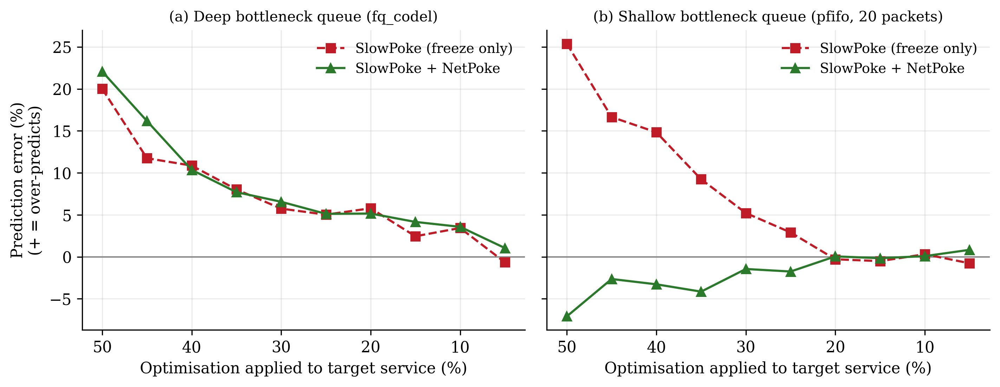

# NetPoke: Network-Aware Causal Profiling for Throughput Prediction in Microservice Systems
[Overview](#overview) | [Quick Setup](#quick-setup) | [More Info](#more-information) | [Structure](#repository-structure) | [Citing](#citing-netpoke) | [License & Contrib](#license-and-contributing)

> For issues and ideas, [open a GitHub issue](https://github.com/gvafram3/netpoke/issues/new).

NetPoke extends [Slowpoke](https://github.com/atlas-brown/slowpoke) (Xie et al., NSDI '26), a causal profiler that predicts how the end-to-end throughput of a microservice application changes when one service is optimised.
Slowpoke pauses the non-target services with `SIGSTOP`/`SIGCONT` and recovers the optimised throughput from a performance model.
`SIGSTOP` stops a service's CPU, but the kernel keeps transmitting data the service has already queued, so under a network bottleneck Slowpoke's predictions become optimistic.
NetPoke closes and opens an egress hold (the Linux `sch_plug` queueing discipline) together with every pause, so that a pause also stops the paused service's network egress.

To reproduce the results of the paper, jump straight to the [instructions](INSTRUCTIONS.md).

## Overview



Under a network bottleneck, Slowpoke over-predicts throughput by up to 25.4%, and the error grows with the size of the optimisation.
NetPoke removes most of this error when the bottleneck queue is shallow (RMSE 11.32% → 3.84%, right panel).
With a deep bottleneck queue (the Linux default `fq_codel`, left panel), the backlog has already left the paused service when a pause begins, so a source-side hold cannot stop it and NetPoke brings no improvement.
Without a network bottleneck, NetPoke matches Slowpoke's accuracy.

## Quick setup

Using NetPoke requires a Kubernetes cluster whose nodes provide the `sch_plug`, `htb` and `netem` kernel modules.
The paper's experiments use four AWS EC2 `m7i-flex.large` machines (Ubuntu 24.04, Kubernetes v1.29).

<details><summary>Four-node AWS setup used in the paper</summary>

The cluster setup differs between AWS accounts; the following procedure is the one used for the paper and is meant as a reference.

1. Launch four Ubuntu 24.04 instances in one security group, and name them `control`, `worker0`, `worker1` and `worker2` (the benchmark YAMLs pin services to these names).
2. Allow SSH from your address and all traffic between members of the security group.
3. `cp evaluation/netpoke/cluster/config.env.example evaluation/netpoke/cluster/config.env` and fill in the SSH key and the four public IPs.
4. Run `01_check_machines.sh`, `02_bootstrap_nodes.sh`, `03_init_cluster.sh`, `04_day0_checks.sh` and `05_sync_repo.sh` from `evaluation/netpoke/cluster/`, in that order.
5. Stop the instances when you are done; public IPs change after every restart, so update `config.env` when you resume.

The detailed procedure, with expected outputs, is in [INSTRUCTIONS.md](INSTRUCTIONS.md#cluster-setup).
</details>

## More Information

NetPoke is a drop-in extension of Slowpoke's `poker` controller. To use it with a Slowpoke-enabled service:

1. **Build** the service image with [`scripts/build/PrebuiltDockerfile`](scripts/build/PrebuiltDockerfile), which compiles [`poker.c`](src/poker/poker.c) together with [`net_hold.c`](src/poker/net_hold.c) and installs `iproute2` (for the `tc` fallback). Run [`src/poker/sync_to_app.sh`](src/poker/sync_to_app.sh) first; it copies the `poker` sources into the Docker build context (`app/slowpoke/poker/`).
2. **Deploy** each non-target service with the `NET_ADMIN` capability and the environment variable `SLOWPOKE_NETPOKE=1` (`0` gives Slowpoke's published behaviour). `SLOWPOKE_NET_IFACE` selects the interface to hold (default `eth0`). Slowpoke's own variables (`SLOWPOKE_DELAY_MICROS`, `SLOWPOKE_POKER_BATCH_THRESHOLD`, ...) keep their meaning.
3. **Launch** Slowpoke as usual with `./slowpoke` (see the [Slowpoke README](https://github.com/atlas-brown/slowpoke#more-information)). With the hold enabled, `poker` closes the hold immediately before `SIGSTOP`, opens it immediately after `SIGCONT`, and logs `pause_start`/`pause_end` markers for every pause.

[`evaluation/netpoke/control/make_mutex_yamls.py`](evaluation/netpoke/control/make_mutex_yamls.py) shows the change for the `mutex` benchmark: it produces two YAML sets that differ only in `SLOWPOKE_NETPOKE`.

## Repository Structure

The repository follows Slowpoke's layout. NetPoke's changes to Slowpoke are listed in [INSTRUCTIONS.md](INSTRUCTIONS.md#changes-relative-to-slowpoke).

* [app](app): Slowpoke's real-world and synthetic applications, plus the two-service [`mutex`](app/cmd/mutex) benchmark with a configurable response payload.
* [src](src): Slowpoke's control-node component, and [`poker`](src/poker) with NetPoke's egress hold ([`net_hold.c`](src/poker/net_hold.c)).
* [scripts](scripts): Image build files and Slowpoke's EC2 cluster scripts.
* [client](client): Load generator.
* [evaluation](evaluation): Slowpoke's benchmark YAMLs and scripts, unchanged, and [`evaluation/netpoke`](evaluation/netpoke), the NetPoke experiments:
  * [`cluster`](evaluation/netpoke/cluster): setup and helper scripts run from your machine.
  * [`node`](evaluation/netpoke/node): per-node bootstrap and kernel checks.
  * [`control`](evaluation/netpoke/control): experiment harness run on the control node (series runner, network cap, leak measurement, log correction).
  * [`tests`](evaluation/netpoke/tests): kernel-level and in-application egress-leak tools.
  * [`results`](evaluation/netpoke/results): all logs and measurements reported in the paper.
  * [`plot_figures.py`](evaluation/netpoke/plot_figures.py) and [`figures`](evaluation/netpoke/figures): regenerate the paper's figures from the logs.

The paper's evaluation uses only the `mutex` benchmark. Slowpoke's other benchmarks are included unchanged so that NetPoke can be applied to them.

## Citing NetPoke

If you use NetPoke, please cite our paper and the Slowpoke paper it builds on:

```bibtex
@unpublished{netpoke,
  author = {Afram Visca Gyebi},
  title  = {NetPoke: Network-Aware Causal Profiling for Throughput Prediction in Microservice Systems},
  note   = {Manuscript under review},
  year   = {2026}
}

@inproceedings{slowpoke:nsdi:2026,
  author    = {Yizheng Xie and Di Jin and Oğuzhan Çölkesen and Vasiliki Kalavri and John Liagouris and Nikos Vasilakis},
  title     = {Slowpoke: End-to-end Throughput Optimization Modeling for Microservice Applications},
  booktitle = {23rd USENIX Symposium on Networked Systems Design and Implementation (NSDI 26)},
  year      = {2026},
  address   = {Renton, WA},
  publisher = {USENIX Association},
  month     = may
}
```

## License and Contributing

NetPoke is released under the [MIT license](LICENSE), like Slowpoke, whose code it includes. Slowpoke is developed by the [ATLAS group](https://atlas.cs.brown.edu/) at Brown University and the [CASP group](https://sites.bu.edu/casp/) at Boston University. NetPoke is developed at the Department of Computer Science, Kwame Nkrumah University of Science and Technology. See [`CONTRIBUTING.md`](CONTRIBUTING.md) to contribute.
